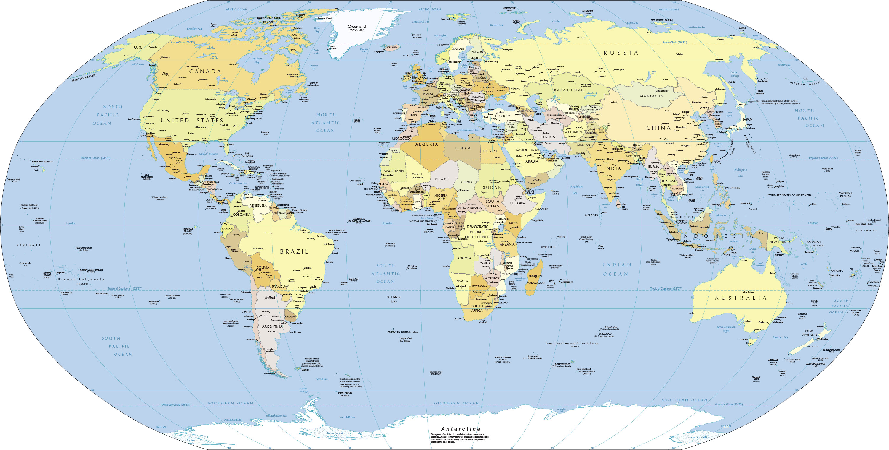

<h1 align="center">
    Countries
</h1>




### What does it gives you?

This package has all sorts of information about countries:

| info            | items |
------------------|-------:|
| taxes           | 32    |
| geometry maps   | 248   |
| topology maps   | 248   |
| currencies      | 256   |
| countries       | 266   |
| timezones       | 423   |
| borders         | 649   |
| flags           | 1,570  |
| states          | 4,526  |
| cities          | 7,376  |
| timezones times | 81,153 |

## Requirements

- PHP 7.0+

## Installing

Use Composer to install it:

```
composer require pragmarx/countries
```

## Instantiating

```php
use PragmaRX\Countries\Package\Countries;

$countries = new Countries();

echo $countries->where('cca2', 'IT')->first()->hydrateCurrencies()->currencies->EUR->coins->frequent->first();

// or calling it statically

echo Countries::where('cca2', 'IT')->first()->hydrateCurrencies()->currencies->EUR->coins->frequent->first();
```

Should both return

Overloading the default configuration:

```php
use PragmaRX\Countries\Package\Services\Config;

$countries = new Countries(new Config([
    'hydrate' => [
        'elements' => [
            'currencies' => true,
            'flag' => true,
            'timezones' => true,
        ],
    ],
]));
```

## Author

>[Bagirishya Rwema Dominique](http://twitter.com/R_w_e_m_a)


>[GitHub](https://github.com/rwema3)

## Contributing

Pull requests and issues are more than welcome.
